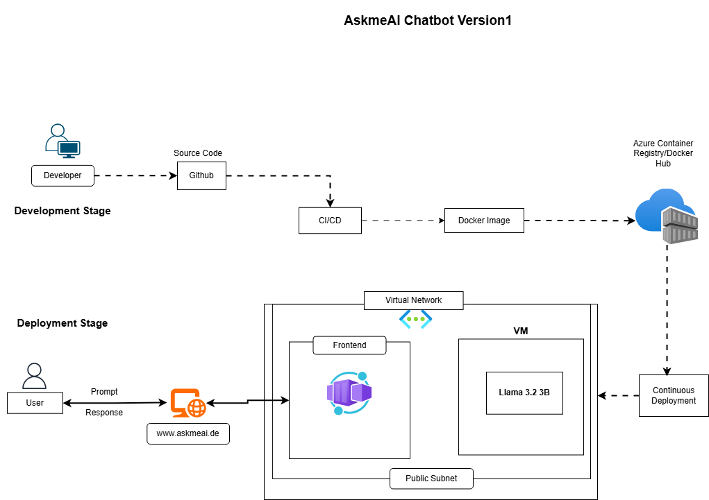

AskMe chatbot using Terraform into Azure Cloud via GitHub actions 

Infrastructure Resources :

1. Virtual Private Cloud (VPC)
2. Virtual Network (VNet)
3. Subnet (1 subnet)
4. Security Groups
5. Azure Blob Storage
6. Azure Virtual Machine (VM)
7. Azure Container Registry (ACR)
8. Azure Container App (for the frontend)
9. Azure Monitoring & Logging (Azure Monitor, Log Analytics)
10. Azure Key Vault (for security and secrets management)
11. Deployment Pipeline
12. GitHub Actions (for CI/CD)
13. DockerHub (for container image storage)
14. Terraform (for Infrastructure as Code deployment)